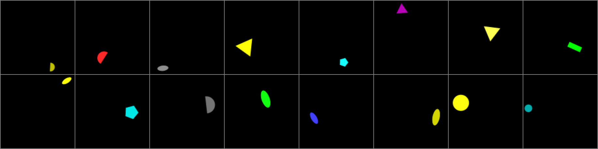
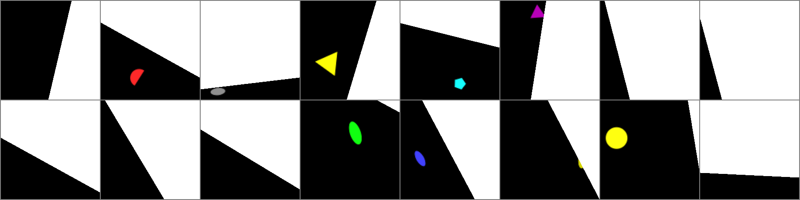
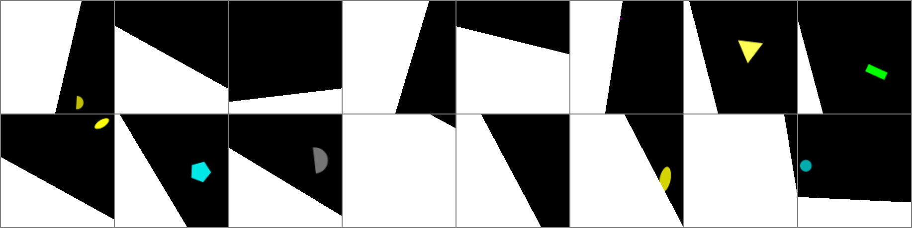

# MultimodalGame

This is a framework for studying multi-agent emergent communication.

## Table of contents
1. [Installation](#installation)
2. [Data](#data)  
    2.1. [Training data](#data)  
    2.2. [Building datasets](#builddata)  
    2.3. [About ShapeWorld](#aboutshapeworld)  
    2.4. [Example Data](#exampledata)  
3. [Training Agents](#training)  
    3.1. [Basic case](#basic)  
    3.2. [Agent pools](#pools)  
    3.3. [Agent communities](#communities)  
    3.4. [Evaluating agents](#eval)  
    3.5. [Generating messages](#messages)  
    3.6. [Helpful bash scripts to analyze log files](#bash)

<a name="installation"></a>
## Installation

Note: this assumes you are using the Anaconda package and environment manager. To install Anaconda see [here](https://conda.io/docs/user-guide/install/index.html).

```bash
git clone --recurse-submodules https://github.com/lgraesser/MultimodalGame.git
cd MultimodalGame
# Install dependencies
conda create --name emergent_comms
source activate emergent_comms
conda install pytorch torchvision -c pytorch
pip install -r requirements.txt
# Install ShapeWorld
pip install -e ShapeWorld
```

### Dependencies

- pyTorch
- h5py
- numpy
- python-gflags
- tqdm
- scikit-image

<a name="data"></a>
## Training data

This model used ShapeWorld datasets. All the datasets used in this project are available [here](https://drive.google.com/drive/folders/1p0GtLX_Y_w78zWoc9Qe8jFPniLOtkr1E?usp=sharing).

- **oneshape**: training dataset, 5k examples
- **oneshape_valid**: in domain evaluation dataset, same distribution as training set, 1k examples
- **oneshape_valid_large**: larger in domain evaluation dataset, same distribution as training set, 5k examples
- **oneshape_valid_all_combos**: out of domain evaluation dataset, contains all of the combinations in the training dataset + 6 held out shape-color combinations. All shapes and colors are contained in the training data, but 6 shape-color combinations are new. 5k examples

See example training and evaluation scripts below for more details of how to use these datasets.

<a name="builddata"></a>
### Building the datasets

To generate an example dataset run the following command. This generates 5000 examples and is equivalent to the training dataset "oneshape" used for this project, available [here](https://drive.google.com/drive/folders/1p0GtLX_Y_w78zWoc9Qe8jFPniLOtkr1E?usp=sharing).

```
mkdir data
cd ShapeWorld
./build_datasets.sh
cd ..
```

The models also depend on pre-trained word embeddings. We recommend using the `6B.100d` GloVe embeddings available [here](https://nlp.stanford.edu/projects/glove/).

<a name="aboutshapeworld"></a>
### About ShapeWorld

ShapeWorld is a framework which allows to specify generators for abstract, visually grounded language data (or just visual data).

It was written by *Alexander Kuhnle and Ann Copestake* (April 2017) and adapted by *Laura Graesser* for this project.

If you use ShapeWorld in your work, please cite:

> **ShapeWorld: A new test methodology for multimodal language understanding** ([arXiv](https://arxiv.org/abs/1704.04517))
> *Alexander Kuhnle and Ann Copestake* (April 2017)

For more details, please see the [original repository](https://github.com/AlexKuhnle/ShapeWorld)

<a name="exampledata"></a>
### Example Data

**Images**


**Partitioned Images**
(Partitions randomly generated at run time)

*Partition 1*


*Partition 2*


**Correct Description**

- there is a yellow semicircle
- there is a red shape
- there is an ellipse
- there is a yellow triangle
- there is a pentagon

**Texts**

- ['there is a yellow shape . ', 'there is a green shape . ', 'there is a semicircle .  ', 'there is a red circle . ', 'there is a cyan triangle . ', 'there is a triangle .  ', 'there is a yellow semicircle . ', 'there is a yellow shape . ', 'there is a green pentagon . ', 'there is a cyan shape . ']
- ['there is a cyan cross . ', 'there is a semicircle .  ', 'there is a square .  ', 'there is a yellow pentagon . ', 'there is a yellow circle . ', 'there is a cyan cross . ', 'there is a red cross . ', 'there is a green rectangle . ', 'there is a red shape . ', 'there is a magenta ellipse . ']
- ['there is a cyan rectangle . ', 'there is a red pentagon . ', 'there is a rectangle .  ', 'there is a green cross . ', 'there is a yellow ellipse . ', 'there is a blue shape . ', 'there is a gray shape . ', 'there is a red pentagon . ', 'there is an ellipse .  ', 'there is a magenta shape . ']
- ['there is a pentagon .  ', 'there is a blue rectangle . ', 'there is a gray pentagon . ', 'there is a magenta shape . ', 'there is a cyan shape . ', 'there is a red rectangle . ', 'there is a yellow triangle . ', 'there is a green ellipse . ', 'there is a magenta ellipse . ', 'there is a magenta shape . ']
- ['there is an ellipse .  ', 'there is a red semicircle . ', 'there is a magenta circle . ', 'there is a gray shape . ', 'there is a pentagon .  ', 'there is a red shape . ', 'there is a gray shape . ', 'there is a blue shape . ', 'there is a green shape . ', 'there is a cyan shape . ']

<a name="training"></a>
## Training agents

Agents can be trained in three configurations.
1. One pair of two agents - the most simple case
2. Pools of n agents - fully connected graph structure
3. Communities of n pools of k agents - sparse graph structure, user defined connectivity. Two sub types
  - Dense: Agents in each pool are connected to agents in every other pool with probability p
  - Chain: Agents in each pool are connected only to agents in neighboring pools with probability p.
    - e.g. 5 pools, with indices 1, 2, 3, 4, 5. Agents in pool 1 are connected only to agents in pool 2, where as agents in pool 2 are connected to agents in pool 1 and 3.


Note: these examples assume that you have downloaded the data from [here](https://drive.google.com/drive/folders/1p0GtLX_Y_w78zWoc9Qe8jFPniLOtkr1E?usp=sharing) and have organized it using the following file structure.

MultimodalGame  
--> data  
----> oneshape  
----> oneshape_valid  
----> oneshape_valid_all_combos  
----> oneshape_valid_large  
--> glove  
---->  glove-100d.txt

<a name="basic"></a>
### Basic case

This trains a pair of agents. See also `./run_scripts/basic.sh`

```bash
python model_symmetric.py
    -experiment_name base  # Used for logs and checkpointing
    -batch_size 32         # Training batch size
    -batch_size_dev 50     # Dev set batch size
    -save_interval  1000   # Checkpoint the model every 1k training steps
    -save_distinct_interval 50000 # Save a distinct checkpoint of the model every 50k training steps
    -m_dim 8               # Dimension of the messages exchanged between agents
    -h_dim 100             # Size of the hidden state
    -desc_dim 100          
    -num_classes 10        # Number of different descriptions the agents have to choose from
    -learning_rate 1e-4    
    -entropy_agent1 0.01   # Weight applied to the entropy bonus for agent 1's message channel
    -entropy_agent2 0.01   # Weight applied to the entropy bonus for agent 2's message channel
    -use_binary            # Whether to have a binary message channel
    -max_epoch 1000        # Number of epochs to train for
    -top_k_dev 1           # Evaluate agents using accuracy @ top k
    -top_k_train 1         # Train agents using accuracy @ top k
    -dataset_path ./data/oneshape/oneshape_simple_textselect # Path to training data
    -dataset_indomain_valid_path ./data/oneshape_valid/oneshape_simple_textselect # Path to in domain dev set
    -dataset_outdomain_valid_path ./data/oneshape_valid_all_combos/oneshape_simple_textselect # Path to out of domain dev set
    -dataset_name oneshape_simple_textselect # Name of the dataset (must be oneshape_simple_textselect) for this data
    -dataset_size_train 5000 # Size of the training data
    -dataset_size_dev 1000   # Size of the dev sets
    -wv_dim 100              # Dimension of the GloVe word vectors
    -glove_path ./glove/glove-100d.txt # Path to word vectors
    -log_path ./logs/        # Where to save logs
    -debug_log_level INFO    # Logging level for debugger
    -cuda                    # Train using cuda
    -log_interval 1000       # Log every k steps
    -log_dev 5000            # Evaluate agents on dev set every k steps
    -log_self_com 25000      # Evaluate agents playing vs. themselves every k steps
    -reward_type "cooperative" # Type of reward used to train the message channel
    -randomize_comms         # Randomize the order of communication from batch to batch. i.e. Randomize who goes first
    -random_seed 17
```

<a name="pools"></a>
### Agent Pools

This trains a pool of 8 agents. For agent pools of 3 or more agents, training is stopped when the average accuracy between any pair of agents reaches 75%. See also `./run_scripts/train_pool8.sh`.

```bash
python model_symmetric.py
    -experiment_name pool8  # Used for logs and checkpointing
    -batch_size 32         # Training batch size
    -batch_size_dev 50     # Dev set batch size
    -save_interval  1000   # Checkpoint the model every 1k training steps
    -save_distinct_interval 50000 # Save a distinct checkpoint of the model every 50k training steps
    -m_dim 8               # Dimension of the messages exchanged between agents
    -h_dim 100             # Size of the hidden state
    -desc_dim 100          
    -num_classes 10        # Number of different descriptions the agents have to choose from
    -learning_rate 1e-4    
    -entropy_agent1 0.01   # Weight applied to the entropy bonus for agent 1's message channel
    -entropy_agent2 0.01   # Weight applied to the entropy bonus for agent 2's message channel
    -use_binary            # Whether to have a binary message channel
    -max_epoch 2000        # Number of epochs to train for
    -top_k_dev 1           # Evaluate agents using accuracy @ top k
    -top_k_train 1         # Train agents using accuracy @ top k
    -dataset_path ./data/oneshape/oneshape_simple_textselect # Path to training data
    -dataset_indomain_valid_path ./data/oneshape_valid/oneshape_simple_textselect # Path to in domain dev set
    -dataset_outdomain_valid_path ./data/oneshape_valid_all_combos/oneshape_simple_textselect # Path to out of domain dev set
    -dataset_name oneshape_simple_textselect # Name of the dataset (must be oneshape_simple_textselect) for this data
    -dataset_size_train 5000 # Size of the training data
    -dataset_size_dev 1000   # Size of the dev sets
    -wv_dim 100              # Dimension of the GloVe word vectors
    -glove_path ./glove/glove-100d.txt # Path to word vectors
    -log_path ./logs/        # Where to save logs
    -debug_log_level INFO    # Logging level for debugger
    -cuda                    # Train using cuda
    -log_interval 1000       # Log every k steps
    -log_dev 5000            # Evaluate agents on dev set every k steps
    -log_self_com 25000      # Evaluate agents playing vs. themselves every k steps
    -log_self_com 50000      # Evaluate agents playing vs. themselves every k steps
    -reward_type "cooperative" # Type of reward used to train the message channel
    -randomize_comms         # Randomize the order of communication from batch to batch. i.e. Randomize who goes first
    -random_seed 17
    -agent_pools             # Specifies that training is with a pool structure
    -num_agents 8            # 8 Agents are in the pool
    -check_accuracy_interval 30000 # How often (in training steps) to check if the average accuracy between any pair of agents has reach 75%.
```

<a name="communities"></a>
### Agent Communities

This trains a community of 5 pools of 5, 5, 10, 5, and 5 agents in a chain structure. For agent pools of 3 or more agents. See also `./run_scripts/train_community_chain_551055.sh`.

```bash
python model_symmetric.py
    -experiment_name chain_551055  # Used for logs and checkpointing
    -batch_size 16         # Training batch size
    -batch_size_dev 50     # Dev set batch size
    -save_interval  1000   # Checkpoint the model every 1k training steps
    -save_distinct_interval 50000 # Save a distinct checkpoint of the model every 50k training steps
    -m_dim 8               # Dimension of the messages exchanged between agents
    -h_dim 100             # Size of the hidden state
    -desc_dim 100          
    -num_classes 10        # Number of different descriptions the agents have to choose from
    -learning_rate 1e-4    
    -entropy_agent1 0.01   # Weight applied to the entropy bonus for agent 1's message channel
    -entropy_agent2 0.01   # Weight applied to the entropy bonus for agent 2's message channel
    -use_binary            # Whether to have a binary message channel
    -max_epoch 2000        # Number of epochs to train for
    -top_k_dev 1           # Evaluate agents using accuracy @ top k
    -top_k_train 1         # Train agents using accuracy @ top k
    -dataset_path ./data/oneshape/oneshape_simple_textselect # Path to training data
    -dataset_indomain_valid_path ./data/oneshape_valid/oneshape_simple_textselect # Path to in domain dev set
    -dataset_outdomain_valid_path ./data/oneshape_valid_all_combos/oneshape_simple_textselect # Path to out of domain dev set
    -dataset_name oneshape_simple_textselect # Name of the dataset (must be oneshape_simple_textselect) for this data
    -dataset_size_train 5000 # Size of the training data
    -dataset_size_dev 1000   # Size of the dev sets
    -wv_dim 100              # Dimension of the GloVe word vectors
    -glove_path ./glove/glove-100d.txt # Path to word vectors
    -log_path ./logs/        # Where to save logs
    -debug_log_level INFO    # Logging level for debugger
    -cuda                    # Train using cuda
    -log_interval 1000       # Log every k steps
    -log_dev 5000            # Evaluate agents on dev set every k steps
    -log_self_com 25000      # Evaluate agents playing vs. themselves every k steps
    -log_self_com 50000      # Evaluate agents playing vs. themselves every k steps
    -reward_type "cooperative" # Type of reward used to train the message channel
    -randomize_comms         # Randomize the order of communication from batch to batch. i.e. Randomize who goes first
    -random_seed 17
    -check_accuracy_interval 100000 # How often (in training steps) to check if the average accuracy between any pair of agents has reach 75%.
    -agent_communities      # Specifies agents are trained with a community structure  ...
    -community_type "chain"  # ... of subtype chain
    -num_communities 5
    -num_agents 30           # Total number of agents in the community
    -num_agents_per_community '5, 5, 10, 5, 5'  # Specify how many agents per community
    -community_checkpoints './models/pool10_1.pt, ./models/pool10_2.pt, ./models/pool10_3.pt, ./models/pool10_4.pt, ./models/pool10_5.pt' # Path to pre-trained pools of agents to initialize community from (optional, communities can be trained from scratch)
    -intra_pool_connect_p '1.0, 1.0, 1.0, 1.0, 1.0' # Proportion of agents in each pool that are connected to each other
    -inter_pool_connect_p 0.2 # Proportion of agents between pools that are connected to each other
    -intra_inter_ratio 1.0  # Ratio of the proportion of training given to agents from the same pool to agents from different pools. 1.0 = 50% / 50% - equal proportion of training given to each. 2.0 = 67% / 33%, agents from the same pool are trained 2x agents across pools. 0.5 = 33% / 67%, agents from different pools are trained 2x agents from the same pool.
```

<a name="eval"></a>
## Evaluating agents

This evaluates a pool of 10 agents by taking all possible pairs of agents and evaluating them on the in domain and out of domain dev sets. See also `./run_scripts/eval_pool10.sh`.

```bash
python model_symmetric.py
    -experiment_name eval_pool10  # Used for logs and checkpointing
    -batch_size 32         # Training batch size
    -batch_size_dev 50     # Dev set batch size
    -save_interval  1000   # Checkpoint the model every 1k training steps
    -save_distinct_interval 50000 # Save a distinct checkpoint of the model every 50k training steps
    -m_dim 8               # Dimension of the messages exchanged between agents
    -h_dim 100             # Size of the hidden state
    -desc_dim 100          
    -num_classes 10        # Number of different descriptions the agents have to choose from
    -learning_rate 1e-4    
    -entropy_agent1 0.01   # Weight applied to the entropy bonus for agent 1's message channel
    -entropy_agent2 0.01   # Weight applied to the entropy bonus for agent 2's message channel
    -use_binary            # Whether to have a binary message channel
    -max_epoch 1000        # Number of epochs to train for
    -top_k_dev 1           # Evaluate agents using accuracy @ top k
    -top_k_train 1         # Train agents using accuracy @ top k
    -dataset_path ./data/oneshape/oneshape_simple_textselect # Path to training data
    -dataset_indomain_valid_path ./data/oneshape_valid/oneshape_simple_textselect # Path to in domain dev set
    -dataset_outdomain_valid_path ./data/oneshape_valid_all_combos/oneshape_simple_textselect # Path to out of domain dev set
    -dataset_name oneshape_simple_textselect # Name of the dataset (must be oneshape_simple_textselect) for this data
    -dataset_size_train 5000 # Size of the training data
    -dataset_size_dev 1000   # Size of the dev sets
    -wv_dim 100              # Dimension of the GloVe word vectors
    -glove_path ./glove/glove-100d.txt # Path to word vectors
    -log_path ./logs/        # Where to save logs
    -debug_log_level INFO    # Logging level for debugger
    -cuda                    # Train using cuda
    -log_interval 1000       # Log every k steps
    -log_dev 5000            # Evaluate agents on dev set every k steps
    -log_self_com 25000      # Evaluate agents playing vs. themselves every k steps
    -log_self_com 50000      # Evaluate agents playing vs. themselves every k steps
    -reward_type "cooperative" # Type of reward used to train the message channel
    -randomize_comms         # Randomize the order of communication from batch to batch. i.e. Randomize who goes first
    -random_seed 17
    -agent_pools             # Specifies that training is with a pool structure
    -num_agents 10            # 10 Agents are in the pool
    -check_accuracy_interval 30000 # How often (in training steps) to check if the average accuracy between any pair of agents has reach 75%.
    -eval_only              # Set to eval mode
    -eval_xproduct          # Evaluate the x-product of all agent pairs
    -checkpoint ./models/pool10_1.pt # Model to evaluate
```

<a name="messages"></a>
## Generating messages

This evaluates a pool of 10 agents by taking all possible pairs of agents and evaluating them on the in domain and out of domain dev sets. See also `./run_scripts/eval_gen_msg_pool10.sh`.

```bash
python model_symmetric.py
    -experiment_name eval_gen_msg_pool10  # Used for logs and checkpointing
    -batch_size 32         # Training batch size
    -batch_size_dev 50     # Dev set batch size
    -save_interval  1000   # Checkpoint the model every 1k training steps
    -save_distinct_interval 50000 # Save a distinct checkpoint of the model every 50k training steps
    -m_dim 8               # Dimension of the messages exchanged between agents
    -h_dim 100             # Size of the hidden state
    -desc_dim 100          
    -num_classes 10        # Number of different descriptions the agents have to choose from
    -learning_rate 1e-4    
    -entropy_agent1 0.01   # Weight applied to the entropy bonus for agent 1's message channel
    -entropy_agent2 0.01   # Weight applied to the entropy bonus for agent 2's message channel
    -use_binary            # Whether to have a binary message channel
    -max_epoch 1000        # Number of epochs to train for
    -top_k_dev 1           # Evaluate agents using accuracy @ top k
    -top_k_train 1         # Train agents using accuracy @ top k
    -dataset_path ./data/oneshape/oneshape_simple_textselect # Path to training data
    -dataset_indomain_valid_path ./data/oneshape_valid/oneshape_simple_textselect # Path to in domain dev set
    -dataset_outdomain_valid_path ./data/oneshape_valid_all_combos/oneshape_simple_textselect # Path to out of domain dev set
    -dataset_name oneshape_simple_textselect # Name of the dataset (must be oneshape_simple_textselect) for this data
    -dataset_size_train 5000 # Size of the training data
    -dataset_size_dev 1000   # Size of the dev sets
    -wv_dim 100              # Dimension of the GloVe word vectors
    -glove_path ./glove/glove-100d.txt # Path to word vectors
    -log_path ./logs/        # Where to save logs
    -debug_log_level INFO    # Logging level for debugger
    -cuda                    # Train using cuda
    -log_interval 1000       # Log every k steps
    -log_dev 5000            # Evaluate agents on dev set every k steps
    -log_self_com 25000      # Evaluate agents playing vs. themselves every k steps
    -log_self_com 50000      # Evaluate agents playing vs. themselves every k steps
    -reward_type "cooperative" # Type of reward used to train the message channel
    -randomize_comms         # Randomize the order of communication from batch to batch. i.e. Randomize who goes first
    -random_seed 17
    -agent_pools             # Specifies that training is with a pool structure
    -num_agents 10            # 10 Agents are in the pool
    -check_accuracy_interval 30000 # How often (in training steps) to check if the average accuracy between any pair of agents has reach 75%.
    -eval_only              # Set to eval mode
    -checkpoint ./models/pool10_1.pt # Model to evaluate
```

<a name="bash"></a>
## Analyzing log files

These files extract different types of tracked data from either the training or eval log files. See the comments in the bash scripts for usage and more details.

- `./logs/analyze_xproduct.sh`: outputs a 2d table of the in domain accuracy for all pairs of agents
- `./logs/analyze_communities.sh`: outputs a table containing the in domain accuracy for all tracked pairs of agents for a community containing 2 pools.
- `./logs/analyze_communities_chain_3.sh`: outputs a table containing the in domain accuracy for all tracked pairs of agents for a chain community containing 3 pools.
- `./logs/analyze_communities_chain_4.sh`: outputs a table containing the in domain accuracy for all tracked pairs of agents for a chain community containing 4 pools.
- `./logs/analyze_communities_chain_5.sh`: outputs a table containing the in domain accuracy for all tracked pairs of agents for a chain community containing 5 pools.
- `./logs/analyze_dense_3.sh`: outputs a table containing the in domain accuracy for all tracked pairs of agents for a dense community containing 3 pools.
- `./logs/analyze_dense_4.sh`: outputs a table containing the in domain accuracy for all tracked pairs of agents for a dense community containing 4 pools.
- `./logs/analyze_dense_5.sh`: outputs a table containing the in domain accuracy for all tracked pairs of agents for a dense community containing 5 pools.
